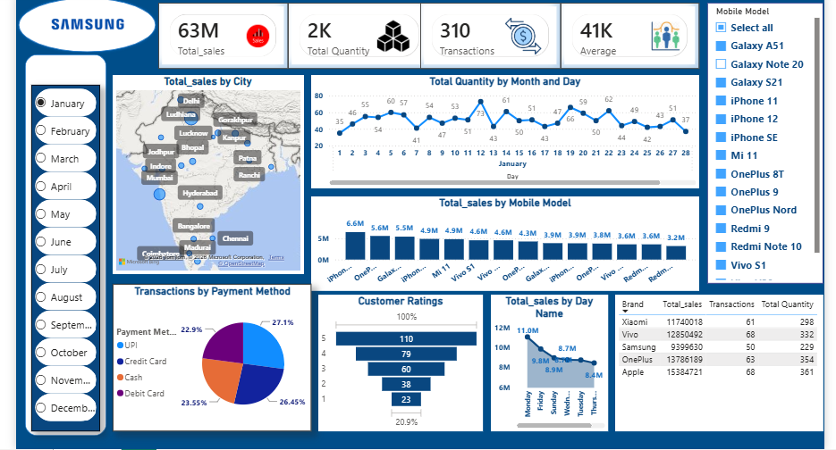

# 📱 Mobile Sales Dashboard

An interactive **Power BI Dashboard** developed to analyze Samsung mobile sales performance using key business metrics and interactive visualizations. This project provides insights into sales trends, customer behavior, payment methods, and product performance to support data-driven business decisions.

---

## 📸 Dashboard Preview



---

## 🎯 Project Objective

The objective of this project is to analyze Samsung mobile sales data and provide actionable business insights through an interactive Power BI dashboard. The dashboard enables users to monitor sales performance, identify top-performing products, evaluate customer ratings, and explore sales trends across cities and payment methods.

---

## 📊 Key Performance Indicators (KPIs)

- 💰 Total Sales: **63M**
- 📦 Total Quantity Sold: **2K**
- 🛒 Total Transactions: **310**
- 👥 Average Customer Count: **41K**

---

## 📈 Dashboard Features

- Monthly Sales Analysis
- City-wise Sales Distribution (Map)
- Sales by Mobile Model
- Daily Sales Trend
- Customer Rating Distribution
- Transactions by Payment Method
- Brand-wise Sales Summary
- Interactive Month Slicer
- Mobile Model Filter

---

## 🛠 Tools & Technologies Used

- Microsoft Power BI
- Power Query
- DAX (Data Analysis Expressions)
- Data Modeling
- Interactive Visualizations

---

## 📂 Dataset Overview

The dataset contains sales information including:

- Mobile Model
- Brand
- Sales Amount
- Quantity Sold
- Transaction Details
- Customer Ratings
- City
- Payment Method
- Date of Purchase

---

## 💡 Business Insights

### 📌 Sales Performance
- Samsung generated approximately **63M** in total sales.
- More than **2,000 units** were sold through **310 transactions**.

### 📌 Customer Behavior
- Most customers provided ratings between **4 and 5 stars**, indicating strong customer satisfaction.
- UPI and Credit Card payments accounted for the majority of transactions.

### 📌 Product Performance
- Galaxy series smartphones contributed significantly to overall sales.
- Sales varied across mobile models, helping identify best-selling and lower-performing products.

### 📌 Geographic Insights
- Sales were distributed across multiple Indian cities.
- Major metropolitan cities contributed a larger share of total revenue.

### 📌 Sales Trends
- Daily sales fluctuated throughout the month with noticeable peaks on specific days.
- The interactive dashboard enables users to analyze sales by month and mobile model.

---

## 📁 Repository Structure

```text
Samsung-Mobile-Sales-Dashboard/
│
├── Samsung_Mobile_Sales_Dashboard.pbix
├── dashboard.png
├── dashboard.pdf
└── README.md
```

---

## 🚀 Skills Demonstrated

- Power BI Dashboard Development
- Data Cleaning
- Data Modeling
- DAX Measures
- Interactive Reporting
- Business Intelligence
- Data Visualization
- Dashboard Design
- Analytical Thinking

---

## 👨‍💻 Author

**Abhishek Aryan**

📊 Aspiring Data Analyst

### Connect with me

- GitHub: https://github.com/AbhishekAryan05
- LinkedIn: https://www.linkedin.com/in/abhishek-aryan-dataanalysis/

---

## ⭐ Support

If you found this project useful, consider giving it a ⭐ on GitHub.
